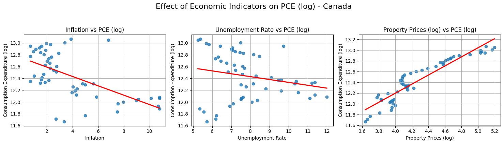

# Economic Factors & Consumption
DSA210_TermProject

## 📑 Table of Contents
1. [Introduction](#introduction)  
2. [Motivation](#motivation)  
3. [Project Goal](#project-goal)
4. [Data Sources](#data-sources)
5. [Methodology](#methodology)
6. [Hypothesis](#hypothesis)
7. [Findings](#findings)   

## Introduction

This project explores the relationship between key macroeconomic indicators **inflation**, **unemployment rates**, and **inflation-adjusted property prices** and **personal consumption expenditure (PCE)**. The goal is to determine the extent to which these variables influence consumer spending habits over time and whether they display consistent patterns across different economies.

**Personal Consumption Expenditure (PCE)** is a critical measure of economic activity, often used to assess the health of a nation's economy. Fluctuations in PCE can signal inflationary pressures, labor market shifts, or changes in household financial behavior.

By analyzing these dynamics in **Canada**, the **United States**, and the **United Kingdom**, this study aims to uncover cross-country differences and similarities in how macroeconomic conditions affect consumer behavior.

> 📊 Through a combination of correlation analysis, regression modeling, and visualization, we aim to draw meaningful conclusions about inflation’s role in shaping economic outcomes.

## Motivation

Macroeconomic conditions—such as inflation, unemployment, and housing market dynamics—directly influence individuals' purchasing power and spending behavior. Understanding these relationships is essential for policymakers, economists, businesses, and consumers seeking to anticipate economic shifts and adapt accordingly.

This project is driven by the following key questions:
- How do inflation rates, unemployment levels, and housing prices collectively influence personal consumption expenditure (PCE)?
- Are certain economic indicators more strongly correlated with PCE changes than others?
- Do cross-country comparisons (Canada, USA, UK) reveal similar or distinct trends in consumer behavior?
- How do fluctuations in real residential property prices affect consumer confidence and spending patterns?

By addressing these questions, the study aims to:
- Provide data-driven insights into the complex interplay between macroeconomic indicators and consumer behavior.
- Support better-informed economic forecasting and policy-making.
- Help businesses understand broader spending trends for more strategic decision-making.

## Project Goal

The primary goal of this project is to **analyze the impact of inflation** on key economic indicators such as:

- Property Prices (log-transformed)
- Unemployment Rate
- Consumption Expenditure (log-transformed)

across three major economies: **Canada**, **United Kingdom**, and **United States**.

Through correlation analysis, regression modeling, and visual exploration, we aim to:

- Quantify how inflation affects housing markets, labor markets, and consumer behavior.
- Identify consistent patterns or differences across countries.
- Provide meaningful economic insights backed by statistical evidence and data visualization.

Ultimately, this project seeks to bridge raw economic data with intuitive visual narratives, enabling a clearer understanding of how macroeconomic pressures influence everyday economic activities.

# Data Sources  

| #  | Data Type | Country | Source Link | Years Covered |
|----|------------|---------|-------------|---------------|
| 1  | Personal Consumption Expenditure | Canada | [Link](https://fred.stlouisfed.org/series/NCRSAXDCCAQ) | 1961-2024 |
| 2  | Personal Consumption Expenditure | US | [Link](https://fred.stlouisfed.org/series/NCRSAXDCUSQ) | 1970-2024 |
| 3  | Personal Consumption Expenditure | UK | [Link](https://fred.stlouisfed.org/series/NCRSAXDCGBQ) | 1995-2024 |
| 4  | Unemployment Rate | Canada | [Link](https://fred.stlouisfed.org/series/LRUNTTTTCAM156S) | 1955-2025 |
| 5  | Unemployment Rate | US | [Link](https://fred.stlouisfed.org/series/UNRATE) | 1948-2025 |
| 6  | Unemployment Rate | UK | [Link](https://fred.stlouisfed.org/series/LRUNTTTTGBQ156S) | 1971-2024 |
| 7  | Inflation | Canada | [Link](https://fred.stlouisfed.org/series/FPCPITOTLZGCAN) | 1960-2023 |
| 8  | Inflation | US | [Link](https://fred.stlouisfed.org/series/FPCPITOTLZGUSA) | 1960-2023 |
| 9  | Inflation | UK | [Link](https://fred.stlouisfed.org/series/FPCPITOTLZGGBR) | 1960-2023 |
| 10 | Real Residential Property Prices | Canada | [Link](https://fred.stlouisfed.org/series/QCAR628BIS) | 1970-2024 |
| 11 | Real Residential Property Prices | US | [Link](https://fred.stlouisfed.org/series/QUSR368BIS) | 1970-2024 |
| 12 | Real Residential Property Prices | UK | [Link](https://fred.stlouisfed.org/series/QGBR368BIS) | 1969-2024 |

These datasets cover multiple years, allowing for a robust analysis of long-term trends and short-term fluctuations in economic indicators.

# Methodology
1. **Data Cleaning & Preprocessing:**
   - Handle missing values and ensure consistency across datasets.
   - Convert all data to a common time format.
2. **Exploratory Data Analysis (EDA):**
   - Compute summary statistics and visualize data.
   - Identify potential correlations between variables.
3. **Statistical Analysis & Hypothesis Testing:**
   - Conduct regression analysis to quantify relationships.
   - Perform seasonal decomposition to detect periodic patterns.
   - Assess the economic impact of  inflation on employment, and consumption trends.
4. **Machine Learning Models (if applicable):**
   - Train predictive models to forecast personal consumption expenditure based on economic indicators.
  
## 📚 Hypothesis

This study aims to examine the impact of **Inflation** on the following key economic indicators:

- 📈 **Property Prices** (log-transformed)  
- 📉 **Unemployment Rate**  
- 💳 **Consumption Expenditure** (log-transformed)

By conducting this analysis for **Canada**, **UK**, and **USA**, we aim to uncover whether inflation has a measurable influence on these socio-economic variables.

### 🎯 Hypotheses

- **Null Hypothesis (H₀):** Inflation has **no significant effect** on the selected economic indicators.  
- **Alternative Hypothesis (H₁):** Inflation has a **significant effect** on at least one of the economic indicators.

We apply **Simple Linear Regression (OLS)** to test these hypotheses and interpret statistical significance using:

- **p-values** (α = 0.05)
- **R-squared values** for explanatory power
- **Visual analysis** through scatter and regression plots

> 📌 This hypothesis-driven approach allows us to quantify and visualize the extent to which inflation may influence prices, spending, and employment in different economic contexts.

## Findings

### 1. Missing Value Analysis

After consolidating datasets from Canada, the United States, and the United Kingdom, we conducted a missing value analysis to ensure data integrity and consistency.

The analysis revealed no missing observations across all key variables inflation rates, unemployment rates, real residential property prices, and personal consumption expenditure for any of the countries.

#### Canada
| Variable                   | Missing Count | Missing Percentage (%) |
|----------------------------|--------------:|-----------------------:|
| Year                       |             0 |                    0.0 |
| Property_Prices            |             0 |                    0.0 |
| Unemployment_Rate          |             0 |                    0.0 |
| Inflation                  |             0 |                    0.0 |
| Consumption_Expenditure    |             0 |                    0.0 |

#### UK
| Variable                   | Missing Count | Missing Percentage (%) |
|----------------------------|--------------:|-----------------------:|
| Year                       |             0 |                    0.0 |
| Property_Prices            |             0 |                    0.0 |
| Unemployment_Rate          |             0 |                    0.0 |
| Inflation                  |             0 |                    0.0 |
| Consumption_Expenditure    |             0 |                    0.0 |

#### USA
| Variable                   | Missing Count | Missing Percentage (%) |
|----------------------------|--------------:|-----------------------:|
| Year                       |             0 |                    0.0 |
| Property_Prices            |             0 |                    0.0 |
| Unemployment_Rate          |             0 |                    0.0 |
| Inflation                  |             0 |                    0.0 |
| Consumption_Expenditure    |             0 |                    0.0 |

### Implication

The absence of missing data enhances the reliability of our statistical models and conclusions, as it eliminates the need for imputation or interpolation, both of which can introduce biases. It ensures that subsequent analyses are based entirely on observed, unaltered data, thereby increasing the robustness of our findings.

> **Note:** Since there were no missing observations, we proceeded to the next phase without any imputation.

### 2. Outlier Analysis (IQR Method)

To ensure the validity of our statistical analyses, we conducted an outlier detection procedure using the Interquartile Range (IQR) method across all key indicators for each country.

The findings were as follows:

- In Canada and the United States, inflation exhibited an outlier rate exceeding 5% of the observations.
- For all other variables — including unemployment rates, property prices, and personal consumption expenditures — the percentage of outliers remained below the 5% threshold.

As a result, Winsorizing was applied to the inflation distributions for Canada and the USA. Winsorization involves capping extreme values to specified percentile limits, thereby reducing the influence of outliers without discarding data points entirely.

### Rationale

Outliers, particularly in inflation data, can severely distort regression estimates and correlation coefficients. By applying Winsorization, we aimed to preserve the structure of the data while mitigating the impact of abnormal observations that could bias our results.

#### Canada
| Feature                   | Outlier Count | Outlier Percentage (%) |
|---------------------------|--------------:|-----------------------:|
| Property_Prices           |             2 |                   3.70 |
| Unemployment_Rate         |             1 |                   1.85 |
| Inflation                 |             5 |                   9.26 |
| Consumption_Expenditure   |             0 |                   0.00 |

#### UK
| Feature                   | Outlier Count | Outlier Percentage (%) |
|---------------------------|--------------:|-----------------------:|
| Property_Prices           |             1 |                   3.45 |
| Unemployment_Rate         |             0 |                   0.00 |
| Inflation                 |             2 |                   6.90 |
| Consumption_Expenditure   |             0 |                   0.00 |

#### USA
| Feature                   | Outlier Count | Outlier Percentage (%) |
|---------------------------|--------------:|-----------------------:|
| Property_Prices           |             1 |                   1.89 |
| Unemployment_Rate         |             0 |                   0.00 |
| Inflation                 |             5 |                   9.43 |
| Consumption_Expenditure   |             0 |                   0.00 |

### Implication

The adjustments ensure that subsequent analyses (correlations, regressions) are more robust, stable, and reflective of underlying economic relationships rather than being skewed by extreme anomalies.

### 3. Correlation Analysis

To explore the interrelationships between key macroeconomic indicators, we computed the Pearson correlation coefficients for inflation, unemployment rate, real property prices, and consumption expenditure across Canada, the United Kingdom, and the United States.

The resulting correlation matrices reveal how strongly (and in which direction) these economic variables are related to one another. Visualized through heatmaps, these relationships offer valuable insights into the economic structures and consumer behaviors of each country.

#### Canada  

In Canada, the correlation analysis highlights a very strong positive relationship between real property prices and consumption expenditure (r = 0.94).
Additionally, a moderate negative correlation is observed between inflation and consumption expenditure (r = -0.56).

These findings suggest that Canadian consumer spending patterns are highly sensitive to changes in real estate markets, potentially due to wealth effects whereby rising property values boost household confidence and expenditures. In contrast, inflationary pressures tend to suppress consumption, though the effect is less dominant compared to property prices.

  
|                          | Inflation | Unemployment_Rate | Property_Prices | Consumption_Expenditure |
|--------------------------|----------:|------------------:|----------------:|------------------------:|
| **Inflation**            |      1.00 |             -0.05 |           -0.37 |                   -0.56 |
| **Unemployment_Rate**    |     -0.05 |              1.00 |           -0.37 |                   -0.31 |
| **Property_Prices**      |     -0.37 |             -0.37 |            1.00 |                    0.94 |
| **Consumption_Expenditure** |  -0.56 |             -0.31 |            0.94 |                    1.00 |

#### UK  

In the United Kingdom, inflation exhibits a moderate negative correlation with property prices (r = -0.54) and a weaker positive correlation with consumption expenditure (r = 0.33).

Interestingly, the unemployment rate shows a moderate negative correlation with consumption expenditure (r = -0.57), implying that rising unemployment directly dampens consumer spending. This pattern points to the critical role of labor market stability in sustaining household consumption within the UK economy.

  
|                          | Inflation | Unemployment_Rate | Property_Prices | Consumption_Expenditure |
|--------------------------|----------:|------------------:|----------------:|------------------------:|
| **Inflation**            |      1.00 |             -0.08 |           -0.54 |                    0.33 |
| **Unemployment_Rate**    |     -0.08 |              1.00 |           -0.28 |                   -0.57 |
| **Property_Prices**      |     -0.54 |             -0.28 |            1.00 |                   -0.35 |
| **Consumption_Expenditure** |  0.33  |             -0.57 |           -0.35 |                    1.00 |

#### USA  

In the United States, the most notable finding is a moderate negative correlation between inflation and consumption expenditure (r = -0.53).

Unlike Canada and the UK, real property prices in the US show only a weak correlation with consumption (r = 0.08), suggesting that real estate fluctuations are less tied to consumer behavior compared to other factors. Instead, inflationary pressures seem to play a more prominent role in shaping household spending dynamics

  
|                          | Inflation | Unemployment_Rate | Property_Prices | Consumption_Expenditure |
|--------------------------|----------:|------------------:|----------------:|------------------------:|
| **Inflation**            |      1.00 |              0.09 |           -0.10 |                   -0.53 |
| **Unemployment_Rate**    |      0.09 |              1.00 |           -0.34 |                   -0.34 |
| **Property_Prices**      |     -0.10 |             -0.34 |            1.00 |                    0.08 |
| **Consumption_Expenditure** |  -0.53 |             -0.34 |            0.08 |                    1.00 |

### Implication

The correlation patterns across countries reveal that while inflation consistently exhibits a suppressive effect on consumer expenditure, the strength and mediating factors vary by country.

In Canada, the real estate market is a dominant driver of consumption behavior. In the UK, labor market conditions are more influential. In the US, direct inflationary pressure appears to be the most critical factor affecting household spending.

These differences underscore the importance of country-specific economic structures in mediating the relationship between macroeconomic variables and consumer behavior.
Policymakers must thus tailor their interventions to the unique drivers of consumption within their respective economies.

> **Key takeaways:**  
> - **Canada:** Property_Prices & Consumption_Expenditure very strongly correlated (0.94).  
> - **UK:** Unemployment_Rate shows moderate negative link with Consumption_Expenditure (-0.57).  
> - **USA:** Inflation & Consumption_Expenditure moderately negative (-0.53).

### 4. Scatter Plot Analysis (with Log Transformations)

To further explore the relationships between inflation and other key economic indicators, we created scatter plots for each country. In order to handle skewness and stabilize variance in certain variables (especially property prices and consumption expenditure), logarithmic transformations were applied.

#### Canada  

In Canada, the scatter plots reveal two notable patterns:

- **“Inflation vs. Log Consumption Expenditure shows a clear negative trend, supporting the regression and correlation findings. As inflation increases, consumption tends to decline—indicating that inflationary pressure may directly erode purchasing power.”**

- **“Inflation vs. Log Property Prices displays a weaker, somewhat nonlinear negative relationship. While some downward trend exists, data points are more scattered.”**

The **Inflation vs. Unemployment Rate** plot shows no visible trend, confirming its lack of statistical significance in prior analyses.

  

#### UK  

For the UK:

- **“The relationship between Inflation and Log Property Prices is strongly negative and visually apparent. As inflation rises, property prices (adjusted for inflation) fall significantly. This aligns well with the UK's regression result (R² ≈ 0.53).”**

- **“Inflation vs. Log Consumption Expenditure exhibits no clear trend, supporting the regression conclusion that this relationship is not statistically significant.”**

- **“Inflation vs. Unemployment Rate again appears scattered, with no strong linear association visible.”**
  
  

#### USA  
In the US:

- **“The Inflation vs. Log Consumption Expenditure scatter plot reveals a distinct downward trend, mirroring the regression output where inflation had a significant negative impact on spending.”**

- **“The relationship between Inflation and Property Prices (log) is weak and lacks direction, consistent with the negligible R² and high p-value observed earlier.”**

- **“As with the other countries, Unemployment Rate does not appear to have a strong visual relationship with inflation.”**

  

**Implication:**  
The scatter plot analysis confirms and visually reinforces earlier statistical findings. Inflation tends to suppress consumption expenditure in both **Canada** and the **United States**, with visible downward trends in both cases.  
In the UK, inflation appears to most strongly affect **property prices**, suggesting a housing market more sensitive to inflationary forces.

The consistency across different types of analyses (correlation, regression, scatter plots) enhances the **credibility and robustness** of these conclusions, while the visual format helps identify nonlinearities and residual noise in the data.

The log transformation highlights a clear nonlinear association between Property_Prices and Consumption_Expenditure.
> **Note:** All scatter plots are based on log-transformed values where appropriate (e.g., for Property_Prices and Consumption_Expenditure).

### 5. Regression Analysis: Impact of Inflation on Key Indicators

To explore how inflation influences other socio-economic indicators, we performed simple linear regressions with **Inflation** as the independent variable and three dependent variables:

- **Log_Property_Prices**
- **Unemployment_Rate**
- **Log_Consumption_Expenditure**

We conducted these regressions separately for Canada, the UK, and the USA. The results are summarized below.

---

#### **Canada**
| Dependent Variable            | Coefficient (Inflation) | Intercept | R-squared | p-value (Inflation) |
|------------------------------|-------------------------:|----------:|----------:|---------------------:|
| Log_Property_Prices          |                  -0.0630 |     4.5315 |     0.1929 |              0.0009  |
| Unemployment_Rate            |                  -0.0292 |     7.9709 |     0.0026 |              0.7154  |
| Log_Consumption_Expenditure  |                  -0.0793 |    12.7505 |     0.3720 |              0.0000  |

> **Insights:**  
> - Inflation is **significantly negatively associated** with **Log_Property_Prices** and **Log_Consumption_Expenditure**, suggesting that as inflation rises, both metrics tend to decrease.
> - The **R-squared** for consumption expenditure is relatively strong (0.37), indicating a better model fit.
> - There is **no significant relationship** between inflation and unemployment in Canada (p = 0.7154).

---

#### **UK**
| Dependent Variable            | Coefficient (Inflation) | Intercept | R-squared | p-value (Inflation) |
|------------------------------|-------------------------:|----------:|----------:|---------------------:|
| Log_Property_Prices          |                  -0.6261 |     2.7952 |     0.5274 |              0.0002  |
| Unemployment_Rate            |                  -0.0779 |     5.9651 |     0.0057 |              0.6976  |
| Log_Consumption_Expenditure  |                   0.0335 |    12.8848 |     0.0853 |              0.1242  |

> **Insights:**  
> - A **strong negative relationship** is found between inflation and **Log_Property_Prices** in the UK, with over 50% of the variation explained (R² = 0.53).
> - No statistically significant effect of inflation is observed on unemployment or consumption expenditure.

---

#### **USA**
| Dependent Variable            | Coefficient (Inflation) | Intercept | R-squared | p-value (Inflation) |
|------------------------------|-------------------------:|----------:|----------:|---------------------:|
| Log_Property_Prices          |                   0.0283 |     1.3457 |     0.0079 |              0.6169  |
| Unemployment_Rate            |                   0.0545 |     5.9308 |     0.0080 |              0.5242  |
| Log_Consumption_Expenditure  |                  -0.0994 |    14.8525 |     0.3587 |              0.0000  |

> **Insights:**  
> - Inflation shows a **significant negative impact** on **Log_Consumption_Expenditure** in the USA.
> - However, no meaningful linear relationship is observed with unemployment or property prices (p-values > 0.5, very low R² values).

---

> 💡 **Overall Observation:**  
> Across all three countries, **Log_Consumption_Expenditure** appears to be most consistently and negatively influenced by inflation. In contrast, the relationship between inflation and **Unemployment_Rate** remains weak and statistically insignificant throughout.

### 6. Visualizing Regression Relationships

To further understand how **Inflation** impacts key economic indicators, we created regression scatter plots using a custom plotting function. These visualizations include regression lines to highlight linear trends.

For each country, we analyzed the relationship between Inflation and the following:
- **Log_Property_Prices**
- **Unemployment_Rate**
- **Log_Consumption_Expenditure**

#### Canada  
  
> - A **clear negative trend** is visible between Inflation and both **Property Prices (log)** and **Consumption Expenditure (log)**.  
> - This supports the regression summary, where both relationships were statistically significant.  
> - **Unemployment Rate** shows no visible trend, consistent with its high p-value.

---

#### UK  
  
> - The negative linear relationship between Inflation and **Property Prices (log)** is visually strong, matching the high R² from the regression.  
> - Again, **Unemployment Rate** appears flat and scattered.  
> - A **slight positive trend** is observed between Inflation and **Consumption Expenditure (log)**, though it's not statistically significant.

---

#### USA  
  
> - The **strongest visual relationship** is observed between Inflation and **Consumption Expenditure (log)** — consistent with the regression result (p < 0.001, R² = 0.36).  
> - Other relationships appear **weak or random**, with scattered points and near-flat regression lines.

---

> 🔍 **Conclusion:**  
> These plots provide visual support for our regression findings. In particular, **log-transformed consumption expenditure** appears **consistently and negatively associated** with inflation in both Canada and the US, while property prices are most sensitive to inflation in the UK.
>

### 7. 📊 Hypothesis Testing Results

To statistically validate the effect of **inflation** on each economic indicator, we conducted **Simple Linear Regression (OLS)** analyses using a 5% significance level (α = 0.05).

For each country, we tested the following hypotheses:

- **Null Hypothesis (H₀):** Inflation has **no significant effect** on the dependent variable.  
- **Alternative Hypothesis (H₁):** Inflation has a **significant effect** on the dependent variable.

A hypothesis was **rejected** if the p-value was less than 0.05.
  - If *p < 0.05* → Reject H₀  
  - If *p ≥ 0.05* → Fail to Reject H₀

#### Canada

| Dependent Variable            | Coefficient (Inflation) | Intercept | R-squared | p-value | Hypothesis Decision     |
|------------------------------|-------------------------:|----------:|----------:|--------:|--------------------------|
| Log_Property_Prices          |                  -0.0630 |     4.5315 |     0.1929 |  0.0009 | **Reject H₀**            |
| Unemployment_Rate            |                  -0.0292 |     7.9709 |     0.0026 |  0.7154 | Fail to Reject H₀        |
| Log_Consumption_Expenditure  |                  -0.0793 |    12.7505 |     0.3720 |  0.0000 | **Reject H₀**            |

> ✅ **Significant negative effects** found on property prices and consumption expenditure.
> 📌 **Interpretation:**  
> In Canada, inflation has a statistically significant **negative** effect on both **property prices** and **consumption expenditure**, while it has no meaningful impact on unemployment.  
> This suggests that inflationary pressure erodes consumer spending power and suppresses housing market activity.

---

#### UK

| Dependent Variable            | Coefficient (Inflation) | Intercept | R-squared | p-value | Hypothesis Decision     |
|------------------------------|-------------------------:|----------:|----------:|--------:|--------------------------|
| Log_Property_Prices          |                  -0.6261 |     2.7952 |     0.5274 |  0.0002 | **Reject H₀**            |
| Unemployment_Rate            |                  -0.0779 |     5.9651 |     0.0057 |  0.6976 | Fail to Reject H₀        |
| Log_Consumption_Expenditure  |                   0.0335 |    12.8848 |     0.0853 |  0.1242 | Fail to Reject H₀        |

> ✅ Only **property prices** are significantly affected by inflation in the UK.
> 📌 **Interpretation:**  
> In the UK, inflation shows a strong negative effect on **property prices**, but has **no significant effect** on either unemployment or consumption expenditure.  
> The sensitivity of the UK housing market to inflation may reflect structural vulnerabilities, such as mortgage exposure or housing supply constraints.

---

#### USA

| Dependent Variable            | Coefficient (Inflation) | Intercept | R-squared | p-value | Hypothesis Decision     |
|------------------------------|-------------------------:|----------:|----------:|--------:|--------------------------|
| Log_Property_Prices          |                   0.0283 |     1.3457 |     0.0079 |  0.6169 | Fail to Reject H₀        |
| Unemployment_Rate            |                   0.0545 |     5.9308 |     0.0080 |  0.5242 | Fail to Reject H₀        |
| Log_Consumption_Expenditure  |                  -0.0994 |    14.8525 |     0.3587 |  0.0000 | **Reject H₀**            |

> ✅ In the USA, **only consumption expenditure** shows a statistically significant (and negative) relationship with inflation.
> 📌 **Interpretation:**  
> In the US, inflation has a **significant negative effect** on **consumption expenditure**, while it has **no meaningful effect** on property prices or unemployment.  
> This indicates that American households may react more immediately to price volatility, possibly due to lower saving rates or higher debt sensitivity.

---
## 📌 Summary: 
Across the three countries, we observe **heterogeneous impacts** of inflation:
- In **Canada**, both the housing market and consumption are sensitive to inflation.  
- In the **UK**, the **housing market alone** reacts significantly.  
- In the **US**, **only consumption expenditure** is significantly affected.

These differences may arise from varying housing finance systems, consumer credit dynamics, or institutional responses to inflation.  
Thus, **macro-level inflation does not produce uniform outcomes**, and economic policies must be tailored to country-specific structures and vulnerabilities.
