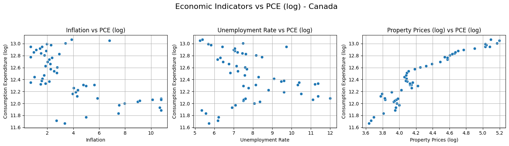

# Economic Factors & Consumption
DSA210_TermProject

## 📑 Table of Contents
1. [Introduction](#introduction)  
2. [Motivation](#motivation)  
3. [Project Goal](#project-goal)  
4. [Project Structure](#project-structure)  
5. [Data Sources](#data-sources)  
6. [Methodology](#methodology)  
7. [Hypothesis](#hypothesis)  
8. [Findings](#findings)  
   1. [Missing Value Analysis](#missing-value-analysis)  
   2. [Outlier Analysis (IQR Method)](#outlier-analysis-iqr-method)  
   3. [Correlation Analysis](#correlation-analysis)  
   4. [Scatter Plot Analysis (with Log Transformations)](#scatter-plot-analysis-with-log-transformations)  
   5. [Regression Analysis: Impact of Inflation on Key Indicators](#regression-analysis-impact-of-inflation-on-key-indicators)  
   6. [Visualizing Regression Relationships](#visualizing-regression-relationships)  
   7. [Hypothesis Testing Results](#hypothesis-testing-results)  

## Introduction

This project explores the relationship between key macroeconomic indicators **inflation**, **unemployment rates**, and **inflation-adjusted property prices** and **personal consumption expenditure (PCE)**. The goal is to determine the extent to which these variables influence consumer spending habits over time and whether they display consistent patterns across different economies.

**Personal Consumption Expenditure (PCE)** is a critical measure of economic activity, often used to assess the health of a nation's economy. Fluctuations in PCE can signal inflationary pressures, labor market shifts, or changes in household financial behavior.

By analyzing these dynamics in **Canada**, the **United States**, and the **United Kingdom**, this study aims to uncover cross-country differences and similarities in how macroeconomic conditions affect consumer behavior.

> 📊 Through a combination of correlation analysis, regression modeling, and visualization, we aim to draw meaningful conclusions about inflation’s role in shaping economic outcomes.

## Motivation

Macroeconomic conditions—such as inflation, unemployment, and housing market dynamics—directly influence individuals' purchasing power and spending behavior. Understanding these relationships is essential for policymakers, economists, businesses, and consumers seeking to anticipate economic shifts and adapt accordingly.

This project is driven by the following key questions:
- How do inflation rates, unemployment levels, and housing prices collectively influence personal consumption expenditure (PCE)?
- Are certain economic indicators more strongly correlated with PCE changes than others?
- Do cross-country comparisons (Canada, USA, UK) reveal similar or distinct trends in consumer behavior?
- How do fluctuations in real residential property prices affect consumer confidence and spending patterns?

By addressing these questions, the study aims to:
- Provide data-driven insights into the complex interplay between macroeconomic indicators and consumer behavior.
- Support better-informed economic forecasting and policy-making.
- Help businesses understand broader spending trends for more strategic decision-making.

## Project Goal

The primary goal of this project is to **analyze the impact of inflation** on key economic indicators such as:

- Property Prices (log-transformed)
- Unemployment Rate
- Consumption Expenditure (log-transformed)

across three major economies: **Canada**, **United Kingdom**, and **United States**.

Through correlation analysis, regression modeling, and visual exploration, we aim to:

- Quantify how inflation affects housing markets, labor markets, and consumer behavior.
- Identify consistent patterns or differences across countries.
- Provide meaningful economic insights backed by statistical evidence and data visualization.

Ultimately, this project seeks to bridge raw economic data with intuitive visual narratives, enabling a clearer understanding of how macroeconomic pressures influence everyday economic activities.

# Data Sources  

| #  | Data Type | Country | Source Link | Years Covered |
|----|------------|---------|-------------|---------------|
| 1  | Personal Consumption Expenditure | Canada | [Link](https://fred.stlouisfed.org/series/NCRSAXDCCAQ) | 1961-2024 |
| 2  | Personal Consumption Expenditure | US | [Link](https://fred.stlouisfed.org/series/NCRSAXDCUSQ) | 1970-2024 |
| 3  | Personal Consumption Expenditure | UK | [Link](https://fred.stlouisfed.org/series/NCRSAXDCGBQ) | 1995-2024 |
| 4  | Unemployment Rate | Canada | [Link](https://fred.stlouisfed.org/series/LRUNTTTTCAM156S) | 1955-2025 |
| 5  | Unemployment Rate | US | [Link](https://fred.stlouisfed.org/series/UNRATE) | 1948-2025 |
| 6  | Unemployment Rate | UK | [Link](https://fred.stlouisfed.org/series/LRUNTTTTGBQ156S) | 1971-2024 |
| 7  | Inflation | Canada | [Link](https://fred.stlouisfed.org/series/FPCPITOTLZGCAN) | 1960-2023 |
| 8  | Inflation | US | [Link](https://fred.stlouisfed.org/series/FPCPITOTLZGUSA) | 1960-2023 |
| 9  | Inflation | UK | [Link](https://fred.stlouisfed.org/series/FPCPITOTLZGGBR) | 1960-2023 |
| 10 | Real Residential Property Prices | Canada | [Link](https://fred.stlouisfed.org/series/QCAR628BIS) | 1970-2024 |
| 11 | Real Residential Property Prices | US | [Link](https://fred.stlouisfed.org/series/QUSR368BIS) | 1970-2024 |
| 12 | Real Residential Property Prices | UK | [Link](https://fred.stlouisfed.org/series/QGBR368BIS) | 1969-2024 |

These datasets cover multiple years, allowing for a robust analysis of long-term trends and short-term fluctuations in economic indicators.

# Methodology
1. **Data Cleaning & Preprocessing:**
   - Handle missing values and ensure consistency across datasets.
   - Convert all data to a common time format.
2. **Exploratory Data Analysis (EDA):**
   - Compute summary statistics and visualize data.
   - Identify potential correlations between variables.
3. **Statistical Analysis & Hypothesis Testing:**
   - Conduct regression analysis to quantify relationships.
   - Perform seasonal decomposition to detect periodic patterns.
   - Assess the economic impact of  inflation on employment, and consumption trends.
4. **Machine Learning Models (if applicable):**
   - Train predictive models to forecast personal consumption expenditure based on economic indicators.
  
## 📚 Hypothesis

This study aims to examine the impact of **Inflation** on the following key economic indicators:

- 📈 **Property Prices** (log-transformed)  
- 📉 **Unemployment Rate**  
- 💳 **Consumption Expenditure** (log-transformed)

By conducting this analysis for **Canada**, **UK**, and **USA**, we aim to uncover whether inflation has a measurable influence on these socio-economic variables.

### 🎯 Hypotheses

- **Null Hypothesis (H₀):** Inflation has **no significant effect** on the selected economic indicators.  
- **Alternative Hypothesis (H₁):** Inflation has a **significant effect** on at least one of the economic indicators.

We apply **Simple Linear Regression (OLS)** to test these hypotheses and interpret statistical significance using:

- **p-values** (α = 0.05)
- **R-squared values** for explanatory power
- **Visual analysis** through scatter and regression plots

> 📌 This hypothesis-driven approach allows us to quantify and visualize the extent to which inflation may influence prices, spending, and employment in different economic contexts.

## Findings

### 1. Missing Value Analysis

After loading and consolidating the full dataset, we performed a missing‐value analysis for each country. The results below show that **no** missing values were found in any of the key variables for Canada, the UK, or the USA—hence, no imputation was necessary.

#### Canada
| Variable                   | Missing Count | Missing Percentage (%) |
|----------------------------|--------------:|-----------------------:|
| Year                       |             0 |                    0.0 |
| Property_Prices            |             0 |                    0.0 |
| Unemployment_Rate          |             0 |                    0.0 |
| Inflation                  |             0 |                    0.0 |
| Consumption_Expenditure    |             0 |                    0.0 |

#### UK
| Variable                   | Missing Count | Missing Percentage (%) |
|----------------------------|--------------:|-----------------------:|
| Year                       |             0 |                    0.0 |
| Property_Prices            |             0 |                    0.0 |
| Unemployment_Rate          |             0 |                    0.0 |
| Inflation                  |             0 |                    0.0 |
| Consumption_Expenditure    |             0 |                    0.0 |

#### USA
| Variable                   | Missing Count | Missing Percentage (%) |
|----------------------------|--------------:|-----------------------:|
| Year                       |             0 |                    0.0 |
| Property_Prices            |             0 |                    0.0 |
| Unemployment_Rate          |             0 |                    0.0 |
| Inflation                  |             0 |                    0.0 |
| Consumption_Expenditure    |             0 |                    0.0 |

> **Note:** Since there were no missing observations, we proceeded to the next phase without any imputation.

### 2. Outlier Analysis (IQR Method)

We tested each feature for outliers using the Interquartile Range (IQR) method. Whenever a feature’s outlier rate exceeded 5 %, we planned to apply Winsorizing to cap extreme values.

#### Canada
| Feature                   | Outlier Count | Outlier Percentage (%) |
|---------------------------|--------------:|-----------------------:|
| Property_Prices           |             2 |                   3.70 |
| Unemployment_Rate         |             1 |                   1.85 |
| Inflation                 |             5 |                   9.26 |
| Consumption_Expenditure   |             0 |                   0.00 |

#### UK
| Feature                   | Outlier Count | Outlier Percentage (%) |
|---------------------------|--------------:|-----------------------:|
| Property_Prices           |             1 |                   3.45 |
| Unemployment_Rate         |             0 |                   0.00 |
| Inflation                 |             2 |                   6.90 |
| Consumption_Expenditure   |             0 |                   0.00 |

#### USA
| Feature                   | Outlier Count | Outlier Percentage (%) |
|---------------------------|--------------:|-----------------------:|
| Property_Prices           |             1 |                   1.89 |
| Unemployment_Rate         |             0 |                   0.00 |
| Inflation                 |             5 |                   9.43 |
| Consumption_Expenditure   |             0 |                   0.00 |

> **Note:**  
> - Inflation in both Canada (9.26 %) and the USA (9.43 %) exceeded our 5 % threshold, so we applied Winsorizing to those distributions.  
> - All other features had outlier rates below 5 %, so they remained unchanged.

### 3. Correlation Analysis

We computed pairwise Pearson correlations to understand relationships among our indicators. A heatmap and numeric matrices for each country are shown below.

#### Canada  
  
|                          | Inflation | Unemployment_Rate | Property_Prices | Consumption_Expenditure |
|--------------------------|----------:|------------------:|----------------:|------------------------:|
| **Inflation**            |      1.00 |             -0.05 |           -0.37 |                   -0.56 |
| **Unemployment_Rate**    |     -0.05 |              1.00 |           -0.37 |                   -0.31 |
| **Property_Prices**      |     -0.37 |             -0.37 |            1.00 |                    0.94 |
| **Consumption_Expenditure** |  -0.56 |             -0.31 |            0.94 |                    1.00 |

#### UK  
  
|                          | Inflation | Unemployment_Rate | Property_Prices | Consumption_Expenditure |
|--------------------------|----------:|------------------:|----------------:|------------------------:|
| **Inflation**            |      1.00 |             -0.08 |           -0.54 |                    0.33 |
| **Unemployment_Rate**    |     -0.08 |              1.00 |           -0.28 |                   -0.57 |
| **Property_Prices**      |     -0.54 |             -0.28 |            1.00 |                   -0.35 |
| **Consumption_Expenditure** |  0.33  |             -0.57 |           -0.35 |                    1.00 |

#### USA  
  
|                          | Inflation | Unemployment_Rate | Property_Prices | Consumption_Expenditure |
|--------------------------|----------:|------------------:|----------------:|------------------------:|
| **Inflation**            |      1.00 |              0.09 |           -0.10 |                   -0.53 |
| **Unemployment_Rate**    |      0.09 |              1.00 |           -0.34 |                   -0.34 |
| **Property_Prices**      |     -0.10 |             -0.34 |            1.00 |                    0.08 |
| **Consumption_Expenditure** |  -0.53 |             -0.34 |            0.08 |                    1.00 |

> **Key takeaways:**  
> - **Canada:** Property_Prices & Consumption_Expenditure very strongly correlated (0.94).  
> - **UK:** Unemployment_Rate shows moderate negative link with Consumption_Expenditure (-0.57).  
> - **USA:** Inflation & Consumption_Expenditure moderately negative (-0.53).

### 4. Scatter Plot Analysis (with Log Transformations)

To gain deeper insight into the relationships between variables—especially where large outliers might obscure patterns—we applied a logarithmic transformation to selected indicators. This helped normalize skewed data and clarify trends. Below, we present scatter plots for each country after applying these transformations.

#### Canada  
  

#### UK  
  

#### USA  
  

The log transformation highlights a clear nonlinear association between Property_Prices and Consumption_Expenditure.
> **Note:** All scatter plots are based on log-transformed values where appropriate (e.g., for Property_Prices and Consumption_Expenditure).

### 5. Regression Analysis: Impact of Inflation on Key Indicators

To explore how inflation influences other socio-economic indicators, we performed simple linear regressions with **Inflation** as the independent variable and three dependent variables:

- **Log_Property_Prices**
- **Unemployment_Rate**
- **Log_Consumption_Expenditure**

We conducted these regressions separately for Canada, the UK, and the USA. The results are summarized below.

---

#### **Canada**
| Dependent Variable            | Coefficient (Inflation) | Intercept | R-squared | p-value (Inflation) |
|------------------------------|-------------------------:|----------:|----------:|---------------------:|
| Log_Property_Prices          |                  -0.0630 |     4.5315 |     0.1929 |              0.0009  |
| Unemployment_Rate            |                  -0.0292 |     7.9709 |     0.0026 |              0.7154  |
| Log_Consumption_Expenditure  |                  -0.0793 |    12.7505 |     0.3720 |              0.0000  |

> **Insights:**  
> - Inflation is **significantly negatively associated** with **Log_Property_Prices** and **Log_Consumption_Expenditure**, suggesting that as inflation rises, both metrics tend to decrease.
> - The **R-squared** for consumption expenditure is relatively strong (0.37), indicating a better model fit.
> - There is **no significant relationship** between inflation and unemployment in Canada (p = 0.7154).

---

#### **UK**
| Dependent Variable            | Coefficient (Inflation) | Intercept | R-squared | p-value (Inflation) |
|------------------------------|-------------------------:|----------:|----------:|---------------------:|
| Log_Property_Prices          |                  -0.6261 |     2.7952 |     0.5274 |              0.0002  |
| Unemployment_Rate            |                  -0.0779 |     5.9651 |     0.0057 |              0.6976  |
| Log_Consumption_Expenditure  |                   0.0335 |    12.8848 |     0.0853 |              0.1242  |

> **Insights:**  
> - A **strong negative relationship** is found between inflation and **Log_Property_Prices** in the UK, with over 50% of the variation explained (R² = 0.53).
> - No statistically significant effect of inflation is observed on unemployment or consumption expenditure.

---

#### **USA**
| Dependent Variable            | Coefficient (Inflation) | Intercept | R-squared | p-value (Inflation) |
|------------------------------|-------------------------:|----------:|----------:|---------------------:|
| Log_Property_Prices          |                   0.0283 |     1.3457 |     0.0079 |              0.6169  |
| Unemployment_Rate            |                   0.0545 |     5.9308 |     0.0080 |              0.5242  |
| Log_Consumption_Expenditure  |                  -0.0994 |    14.8525 |     0.3587 |              0.0000  |

> **Insights:**  
> - Inflation shows a **significant negative impact** on **Log_Consumption_Expenditure** in the USA.
> - However, no meaningful linear relationship is observed with unemployment or property prices (p-values > 0.5, very low R² values).

---

> 💡 **Overall Observation:**  
> Across all three countries, **Log_Consumption_Expenditure** appears to be most consistently and negatively influenced by inflation. In contrast, the relationship between inflation and **Unemployment_Rate** remains weak and statistically insignificant throughout.

### 6. Visualizing Regression Relationships

To further understand how **Inflation** impacts key economic indicators, we created regression scatter plots using a custom plotting function. These visualizations include regression lines to highlight linear trends.

For each country, we analyzed the relationship between Inflation and the following:
- **Log_Property_Prices**
- **Unemployment_Rate**
- **Log_Consumption_Expenditure**

#### Canada  
  
> - A **clear negative trend** is visible between Inflation and both **Property Prices (log)** and **Consumption Expenditure (log)**.  
> - This supports the regression summary, where both relationships were statistically significant.  
> - **Unemployment Rate** shows no visible trend, consistent with its high p-value.

---

#### UK  
  
> - The negative linear relationship between Inflation and **Property Prices (log)** is visually strong, matching the high R² from the regression.  
> - Again, **Unemployment Rate** appears flat and scattered.  
> - A **slight positive trend** is observed between Inflation and **Consumption Expenditure (log)**, though it's not statistically significant.

---

#### USA  
  
> - The **strongest visual relationship** is observed between Inflation and **Consumption Expenditure (log)** — consistent with the regression result (p < 0.001, R² = 0.36).  
> - Other relationships appear **weak or random**, with scattered points and near-flat regression lines.

---

> 🔍 **Conclusion:**  
> These plots provide visual support for our regression findings. In particular, **log-transformed consumption expenditure** appears **consistently and negatively associated** with inflation in both Canada and the US, while property prices are most sensitive to inflation in the UK.
>

### 7. 📊 Hypothesis Testing Results

To statistically validate our assumptions, we performed **simple linear regression analyses** with **Inflation** as the independent variable and tested the following:

- Whether inflation has a statistically significant effect on each indicator
- Using a **significance level of 0.05 (α = 0.05)**
- Decisions are based on p-values:  
  - If *p < 0.05* → Reject H₀  
  - If *p ≥ 0.05* → Fail to Reject H₀

#### Canada

| Dependent Variable            | Coefficient (Inflation) | Intercept | R-squared | p-value | Hypothesis Decision     |
|------------------------------|-------------------------:|----------:|----------:|--------:|--------------------------|
| Log_Property_Prices          |                  -0.0630 |     4.5315 |     0.1929 |  0.0009 | **Reject H₀**            |
| Unemployment_Rate            |                  -0.0292 |     7.9709 |     0.0026 |  0.7154 | Fail to Reject H₀        |
| Log_Consumption_Expenditure  |                  -0.0793 |    12.7505 |     0.3720 |  0.0000 | **Reject H₀**            |

> ✅ **Significant negative effects** found on property prices and consumption expenditure.

---

#### UK

| Dependent Variable            | Coefficient (Inflation) | Intercept | R-squared | p-value | Hypothesis Decision     |
|------------------------------|-------------------------:|----------:|----------:|--------:|--------------------------|
| Log_Property_Prices          |                  -0.6261 |     2.7952 |     0.5274 |  0.0002 | **Reject H₀**            |
| Unemployment_Rate            |                  -0.0779 |     5.9651 |     0.0057 |  0.6976 | Fail to Reject H₀        |
| Log_Consumption_Expenditure  |                   0.0335 |    12.8848 |     0.0853 |  0.1242 | Fail to Reject H₀        |

> ✅ Only **property prices** are significantly affected by inflation in the UK.

---

#### USA

| Dependent Variable            | Coefficient (Inflation) | Intercept | R-squared | p-value | Hypothesis Decision     |
|------------------------------|-------------------------:|----------:|----------:|--------:|--------------------------|
| Log_Property_Prices          |                   0.0283 |     1.3457 |     0.0079 |  0.6169 | Fail to Reject H₀        |
| Unemployment_Rate            |                   0.0545 |     5.9308 |     0.0080 |  0.5242 | Fail to Reject H₀        |
| Log_Consumption_Expenditure  |                  -0.0994 |    14.8525 |     0.3587 |  0.0000 | **Reject H₀**            |

> ✅ In the USA, **only consumption expenditure** shows a statistically significant (and negative) relationship with inflation.

---

> 📌 **Summary:**  
> - Inflation significantly impacts **consumption expenditure** in **Canada and the USA**.  
> - **Property prices** are most affected in the **UK**.  
> - **Unemployment rate** is not significantly impacted by inflation in any country.

