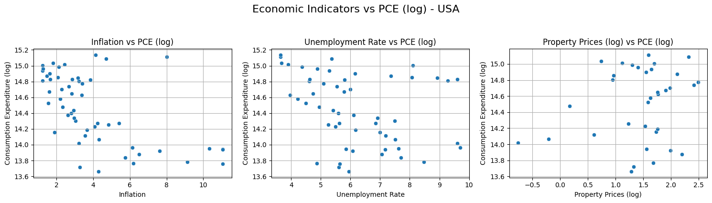

# Economic Factors & Consumption
DSA210_TermProject

## 📑 Table of Contents
1. [Introduction](#introduction)  
2. [Motivation](#motivation)  
3. [Project Goal](#project-goal)
4. [Data Sources](#data-sources)
5. [Methodology](#methodology)
6. [Hypothesis](#hypothesis)
7. [Findings](#findings)
8. [Machine Learning Analysis](#machine-learning-analysis)

## Introduction

This project explores the relationship between key macroeconomic indicators **inflation**, **unemployment rates**, and **inflation-adjusted property prices** and **personal consumption expenditure (PCE)**. The goal is to determine the extent to which these variables influence consumer spending habits over time and whether they display consistent patterns across different economies.

**Personal Consumption Expenditure (PCE)** is a critical measure of economic activity, often used to assess the health of a nation's economy. Fluctuations in PCE can signal inflationary pressures, labor market shifts, or changes in household financial behavior.

By analyzing these dynamics in **Canada**, the **United States**, and the **United Kingdom**, this study aims to uncover cross-country differences and similarities in how macroeconomic conditions affect consumer behavior.

> 📊 Through a combination of correlation analysis, regression modeling, and visualization, we aim to draw meaningful conclusions about inflation’s role in shaping economic outcomes.

## Motivation

Macroeconomic conditions—such as inflation, unemployment, and housing market dynamics—directly influence individuals' purchasing power and spending behavior. Understanding these relationships is essential for policymakers, economists, businesses, and consumers seeking to anticipate economic shifts and adapt accordingly.

This project is driven by the following key questions:
- How do inflation rates, unemployment levels, and housing prices collectively influence personal consumption expenditure (PCE)?
- Are certain economic indicators more strongly correlated with PCE changes than others?
- Do cross-country comparisons (Canada, USA, UK) reveal similar or distinct trends in consumer behavior?
- How do fluctuations in real residential property prices affect consumer confidence and spending patterns?

By addressing these questions, the study aims to:
- Provide data-driven insights into the complex interplay between macroeconomic indicators and consumer behavior.
- Support better-informed economic forecasting and policy-making.
- Help businesses understand broader spending trends for more strategic decision-making.

## Project Goal

The primary goal is to analyze how key economic indicators — inflation, unemployment, and property prices — affect personal consumption expenditure (PCE) across three major economies: **Canada**, **United Kingdom**, and **United States**.

Through correlation analysis, regression modeling, and visual exploration, we aim to:

- Quantify how inflation affects housing markets, labor markets, and consumer behavior.
- Identify consistent patterns or differences across countries.
- Provide meaningful economic insights backed by statistical evidence and data visualization.

Ultimately, this project seeks to bridge raw economic data with intuitive visual narratives, enabling a clearer understanding of how macroeconomic pressures influence everyday economic activities.

# Data Sources  

| #  | Data Type | Country | Source Link | Years Covered |
|----|------------|---------|-------------|---------------|
| 1  | Personal Consumption Expenditure | Canada | [Link](https://fred.stlouisfed.org/series/NCRSAXDCCAQ) | 1961-2024 |
| 2  | Personal Consumption Expenditure | US | [Link](https://fred.stlouisfed.org/series/NCRSAXDCUSQ) | 1970-2024 |
| 3  | Personal Consumption Expenditure | UK | [Link](https://fred.stlouisfed.org/series/NCRSAXDCGBQ) | 1995-2024 |
| 4  | Unemployment Rate | Canada | [Link](https://fred.stlouisfed.org/series/LRUNTTTTCAM156S) | 1955-2025 |
| 5  | Unemployment Rate | US | [Link](https://fred.stlouisfed.org/series/UNRATE) | 1948-2025 |
| 6  | Unemployment Rate | UK | [Link](https://fred.stlouisfed.org/series/LRUNTTTTGBQ156S) | 1971-2024 |
| 7  | Inflation | Canada | [Link](https://fred.stlouisfed.org/series/FPCPITOTLZGCAN) | 1960-2023 |
| 8  | Inflation | US | [Link](https://fred.stlouisfed.org/series/FPCPITOTLZGUSA) | 1960-2023 |
| 9  | Inflation | UK | [Link](https://fred.stlouisfed.org/series/FPCPITOTLZGGBR) | 1960-2023 |
| 10 | Real Residential Property Prices | Canada | [Link](https://fred.stlouisfed.org/series/QCAR628BIS) | 1970-2024 |
| 11 | Real Residential Property Prices | US | [Link](https://fred.stlouisfed.org/series/QUSR368BIS) | 1970-2024 |
| 12 | Real Residential Property Prices | UK | [Link](https://fred.stlouisfed.org/series/QGBR368BIS) | 1969-2024 |

These datasets cover multiple years, allowing for a robust analysis of long-term trends and short-term fluctuations in economic indicators.

# Methodology
1. **Data Cleaning & Preprocessing:**
   - Handle missing values and ensure consistency across datasets.
   - Convert all data to a common time format.
2. **Exploratory Data Analysis (EDA):**
   - Compute summary statistics and visualize data.
   - Identify potential correlations between variables.
3. **Statistical Analysis & Hypothesis Testing:**
   - Conduct regression analysis to quantify relationships.
   - Perform seasonal decomposition to detect periodic patterns.
   - Assess the economic impact of  inflation on employment, and consumption trends.
4. **Machine Learning Models (if applicable):**
   - Train predictive models to forecast personal consumption expenditure based on economic indicators.
  
## Hypothesis

This study aims to examine the impact of **Inflation** on the following key economic indicators:

- 📈 **Property Prices** (log-transformed)  
- 📉 **Unemployment Rate**  
- 💳 **Consumption Expenditure** (log-transformed)

By conducting this analysis for **Canada**, **UK**, and **USA**, we aim to uncover whether inflation has a measurable influence on these socio-economic variables.

### 🎯 Hypotheses

- **Null Hypothesis (H₀):** Economic indicators (inflation, unemployment, property prices) have **no significant effect** on Personal Consumption Expenditure (PCE).  
- **Alternative Hypothesis (H₁):** At least one economic indicator has a **significant effect** on PCE.

We apply **Simple Linear Regression (OLS)** to test these hypotheses and interpret statistical significance using:

- **p-values** (α = 0.05)
- **R-squared values** for explanatory power
- **Visual analysis** through scatter and regression plots

## Findings

### 1. Missing Value Analysis

After consolidating datasets from Canada, the United States, and the United Kingdom, we conducted a missing value analysis to ensure data integrity and consistency.

The analysis revealed no missing observations across all key variables inflation rates, unemployment rates, real residential property prices, and personal consumption expenditure for any of the countries.

#### Canada
| Variable                   | Missing Count | Missing Percentage (%) |
|----------------------------|--------------:|-----------------------:|
| Year                       |             0 |                    0.0 |
| Property_Prices            |             0 |                    0.0 |
| Unemployment_Rate          |             0 |                    0.0 |
| Inflation                  |             0 |                    0.0 |
| Consumption_Expenditure    |             0 |                    0.0 |

#### UK
| Variable                   | Missing Count | Missing Percentage (%) |
|----------------------------|--------------:|-----------------------:|
| Year                       |             0 |                    0.0 |
| Property_Prices            |             0 |                    0.0 |
| Unemployment_Rate          |             0 |                    0.0 |
| Inflation                  |             0 |                    0.0 |
| Consumption_Expenditure    |             0 |                    0.0 |

#### USA
| Variable                   | Missing Count | Missing Percentage (%) |
|----------------------------|--------------:|-----------------------:|
| Year                       |             0 |                    0.0 |
| Property_Prices            |             0 |                    0.0 |
| Unemployment_Rate          |             0 |                    0.0 |
| Inflation                  |             0 |                    0.0 |
| Consumption_Expenditure    |             0 |                    0.0 |

### Implication

The absence of missing data enhances the reliability of our statistical models and conclusions, as it eliminates the need for imputation or interpolation, both of which can introduce biases. It ensures that subsequent analyses are based entirely on observed, unaltered data, thereby increasing the robustness of our findings.

> **Note:** Since there were no missing observations, we proceeded to the next phase without any imputation.

### 2. Outlier Analysis (IQR Method)

To ensure the validity of our statistical analyses, we conducted an outlier detection procedure using the Interquartile Range (IQR) method across all key indicators for each country.

The findings were as follows:

- In Canada and the United States, inflation exhibited an outlier rate exceeding 5% of the observations.
- For all other variables — including unemployment rates, property prices, and personal consumption expenditures — the percentage of outliers remained below the 5% threshold.

As a result, Winsorizing was applied to the inflation distributions for Canada and the USA. Winsorization involves capping extreme values to specified percentile limits, thereby reducing the influence of outliers without discarding data points entirely.

### Rationale

Outliers, particularly in inflation data, can severely distort regression estimates and correlation coefficients. By applying Winsorization, we aimed to preserve the structure of the data while mitigating the impact of abnormal observations that could bias our results.

#### Canada
| Feature                   | Outlier Count | Outlier Percentage (%) |
|---------------------------|--------------:|-----------------------:|
| Property_Prices           |             2 |                   3.70 |
| Unemployment_Rate         |             1 |                   1.85 |
| Inflation                 |             5 |                   9.26 |
| Consumption_Expenditure   |             0 |                   0.00 |

#### UK
| Feature                   | Outlier Count | Outlier Percentage (%) |
|---------------------------|--------------:|-----------------------:|
| Property_Prices           |             1 |                   3.45 |
| Unemployment_Rate         |             0 |                   0.00 |
| Inflation                 |             2 |                   6.90 |
| Consumption_Expenditure   |             0 |                   0.00 |

#### USA
| Feature                   | Outlier Count | Outlier Percentage (%) |
|---------------------------|--------------:|-----------------------:|
| Property_Prices           |             1 |                   1.89 |
| Unemployment_Rate         |             0 |                   0.00 |
| Inflation                 |             5 |                   9.43 |
| Consumption_Expenditure   |             0 |                   0.00 |

### Implication

The adjustments ensure that subsequent analyses (correlations, regressions) are more robust, stable, and reflective of underlying economic relationships rather than being skewed by extreme anomalies.

### 3. Correlation Analysis

To explore the interrelationships between key macroeconomic indicators, we computed the Pearson correlation coefficients for inflation, unemployment rate, real property prices, and consumption expenditure across Canada, the United Kingdom, and the United States.

The resulting correlation matrices reveal how strongly (and in which direction) these economic variables are related to one another. Visualized through heatmaps, these relationships offer valuable insights into the economic structures and consumer behaviors of each country.

#### Canada  

In Canada, the correlation analysis highlights a very strong positive relationship between real property prices and consumption expenditure (r = 0.94).
Additionally, a moderate negative correlation is observed between inflation and consumption expenditure (r = -0.56).

These findings suggest that Canadian consumer spending patterns are highly sensitive to changes in real estate markets, potentially due to wealth effects whereby rising property values boost household confidence and expenditures. In contrast, inflationary pressures tend to suppress consumption, though the effect is less dominant compared to property prices.

  
|                          | Inflation | Unemployment_Rate | Property_Prices | Consumption_Expenditure |
|--------------------------|----------:|------------------:|----------------:|------------------------:|
| **Inflation**            |      1.00 |             -0.05 |           -0.37 |                   -0.56 |
| **Unemployment_Rate**    |     -0.05 |              1.00 |           -0.37 |                   -0.31 |
| **Property_Prices**      |     -0.37 |             -0.37 |            1.00 |                    0.94 |
| **Consumption_Expenditure** |  -0.56 |             -0.31 |            0.94 |                    1.00 |

#### UK  

In the United Kingdom, inflation exhibits a moderate negative correlation with property prices (r = -0.54) and a weaker positive correlation with consumption expenditure (r = 0.33).

Interestingly, the unemployment rate shows a moderate negative correlation with consumption expenditure (r = -0.57), implying that rising unemployment directly dampens consumer spending. This pattern points to the critical role of labor market stability in sustaining household consumption within the UK economy.

  
|                          | Inflation | Unemployment_Rate | Property_Prices | Consumption_Expenditure |
|--------------------------|----------:|------------------:|----------------:|------------------------:|
| **Inflation**            |      1.00 |             -0.08 |           -0.54 |                    0.33 |
| **Unemployment_Rate**    |     -0.08 |              1.00 |           -0.28 |                   -0.57 |
| **Property_Prices**      |     -0.54 |             -0.28 |            1.00 |                   -0.35 |
| **Consumption_Expenditure** |  0.33  |             -0.57 |           -0.35 |                    1.00 |

#### USA  

In the United States, the most notable finding is a moderate negative correlation between inflation and consumption expenditure (r = -0.53).

Unlike Canada and the UK, real property prices in the US show only a weak correlation with consumption (r = 0.08), suggesting that real estate fluctuations are less tied to consumer behavior compared to other factors. Instead, inflationary pressures seem to play a more prominent role in shaping household spending dynamics

  
|                          | Inflation | Unemployment_Rate | Property_Prices | Consumption_Expenditure |
|--------------------------|----------:|------------------:|----------------:|------------------------:|
| **Inflation**            |      1.00 |              0.09 |           -0.10 |                   -0.53 |
| **Unemployment_Rate**    |      0.09 |              1.00 |           -0.34 |                   -0.34 |
| **Property_Prices**      |     -0.10 |             -0.34 |            1.00 |                    0.08 |
| **Consumption_Expenditure** |  -0.53 |             -0.34 |            0.08 |                    1.00 |

### Implication

The correlation patterns across countries reveal that while inflation consistently exhibits a suppressive effect on consumer expenditure, the strength and mediating factors vary by country.

In Canada, the real estate market is a dominant driver of consumption behavior. In the UK, labor market conditions are more influential. In the US, direct inflationary pressure appears to be the most critical factor affecting household spending.

These differences underscore the importance of country-specific economic structures in mediating the relationship between macroeconomic variables and consumer behavior.
Policymakers must thus tailor their interventions to the unique drivers of consumption within their respective economies.

> **Key takeaways:**  
> - **Canada:** Property_Prices & Consumption_Expenditure very strongly correlated (0.94).  
> - **UK:** Unemployment_Rate shows moderate negative link with Consumption_Expenditure (-0.57).  
> - **USA:** Inflation & Consumption_Expenditure moderately negative (-0.53).

## 4. Scatter Plot Analysis (with Log Transformations)

To better understand how key economic indicators influence **personal consumption expenditure (PCE)**, we visualized their pairwise relationships using scatter plots for each country.  
Since **property prices** and **consumption expenditure** tend to exhibit skewed distributions, **logarithmic transformations** were applied to stabilize variance and improve interpretability.

### Plot Design

Each set of plots below shows how the following indicators:

- **Inflation**
- **Unemployment Rate**
- **Property Prices (log)**

relate to **log-transformed PCE**, the primary dependent variable in this study.

---

### Canada

- **Inflation vs. Log Consumption Expenditure** shows a **clear negative trend**, supporting the regression and hypothesis testing results. Rising inflation appears to suppress consumer spending, suggesting a potential erosion of purchasing power.

- **Unemployment Rate vs. Log PCE** appears scattered, consistent with the variable’s **insignificance** in the statistical tests.

- **Log Property Prices vs. Log PCE** reveals a **strong positive correlation**. As real estate values rise, consumer expenditure also tends to increase—possibly reflecting broader economic confidence.

---

### United Kingdom

- **Inflation vs. Log PCE** shows no strong trend, supporting the regression finding that inflation's impact on consumption is statistically insignificant in the UK.

- **Unemployment Rate vs. Log PCE** is again visually scattered, with no linear pattern.

- **Log Property Prices vs. Log PCE** demonstrates a **weak negative association**, indicating a possible decoupling of housing markets and consumer behavior under inflationary conditions.

---

### United States

- **Inflation vs. Log PCE** exhibits a noticeable **downward trend**, indicating that higher inflation may deter consumer spending—consistent with the model output.

- **Unemployment Rate vs. Log PCE** does not show a strong linear pattern, suggesting little predictive power.

- **Log Property Prices vs. Log PCE** displays a **slightly positive but weak** association.

### 5. Multiple Regression Analysis: Determinants of Personal Consumption Expenditure (PCE)

To identify which economic indicators significantly influence personal consumption expenditure, we conducted multiple linear regression analyses for **Canada**, the **United Kingdom**, and the **United States**.

The dependent variable in all models is **log-transformed PCE** (`Log_PCE`), while the independent variables include:

- **Inflation**
- **Unemployment Rate**
- **Log_Property_Prices**

---

#### 🇨🇦 **Canada**

| Variable               | Coefficient | p-value | Significance |
|------------------------|------------:|--------:|--------------|
| Inflation              |    -0.0294  |  0.0000 | Significant |
| Unemployment Rate      |     0.0181  |  0.0606 | Not significant |
| Log_Property_Prices    |     0.7830  |  0.0000 | Significant |
| **R-squared**          | **0.928**   |         | Very Strong Fit |

> **Insights:**  
> - PCE **decreases significantly** as **inflation increases**, suggesting erosion in purchasing power.  
> - **Property prices** are strongly and positively associated with PCE, likely reflecting wealth effects or economic confidence.  
> - **Unemployment rate** has a weak and statistically insignificant effect at the 5% level.

---

#### 🇬🇧 **United Kingdom**

| Variable               | Coefficient | p-value | Significance |
|------------------------|------------:|--------:|--------------|
| Inflation              |    -0.0226  |  0.466  | Not significant |
| Unemployment Rate      |    -0.0866  |  0.002  | Significant |
| Log_Property_Prices    |    -0.0696  |  0.066  | Marginal (p ≈ 0.066) |
| **R-squared**          | **0.563**   |         | Moderate Fit |

> **Insights:**  
> - Inflation does **not** have a significant impact on PCE in the UK.  
> - Interestingly, **unemployment** shows a **significant negative effect**, suggesting reduced consumer spending as joblessness rises.  
> - Property prices have a **marginal** negative impact, significant only at the 10% level.

---

#### 🇺🇸 **United States**

| Variable               | Coefficient | p-value | Significance |
|------------------------|------------:|--------:|--------------|
| Inflation              |    -0.1046  |  0.001  | Significant |
| Unemployment Rate      |    -0.1031  |  0.041  | Significant |
| Log_Property_Prices    |     0.1010  |  0.301  | Not significant |
| **R-squared**          | **0.390**   |         | Moderate Fit |

> **Insights:**  
> - PCE in the US is **negatively impacted by both inflation and unemployment**, indicating a vulnerable consumer base under economic stress.  
> - **Property prices** are **not** a significant predictor of PCE in this case.

---

💡 **Overall Observation:**  
Across the three countries, **inflation consistently exhibits a negative effect on PCE**, especially in **Canada** and the **USA**.  
**Unemployment** becomes significant only in the **UK and USA**, while **property prices** are a strong positive predictor in **Canada**, but not elsewhere.

This multivariate analysis supports the hypothesis that **macro-level economic conditions play a significant role in shaping household consumption patterns**, though their relative importance varies across countries.

### 6. Visualizing Regression Relationships for PCE (log)

To gain further insight into how different economic factors influence **personal consumption expenditure (PCE)**, we created regression scatter plots with fitted trend lines. These visualizations make it easier to observe the **direction and strength of linear relationships**.

Each country’s plot shows how PCE (log) responds to:

- **Inflation**
- **Unemployment Rate**
- **Log_Property_Prices**

---

#### 🇨🇦 Canada  
  
> - **Inflation** and **PCE (log)** exhibit a **clear negative relationship**, supporting the strong regression result (p < 0.001, R² = 0.93).  
> - **Unemployment Rate** shows a weak, nearly flat trend, consistent with its borderline statistical insignificance.  
> - **Property Prices (log)** are **strongly positively correlated** with PCE, suggesting that rising real estate values may stimulate consumer spending.

---

#### 🇬🇧 United Kingdom  
  
> - **Unemployment Rate** and **PCE (log)** have a **clear negative trend**, aligning with the significant regression coefficient.  
> - **Property Prices (log)** show a **weak negative slope**, marginally significant.  
> - The relationship between **Inflation** and PCE is visually **unclear**, consistent with its lack of statistical significance.

---

#### 🇺🇸 United States  
  
> - **Inflation** has a **strong negative association** with PCE (log), as shown by the clear downward slope and significant regression results (p = 0.001).  
> - **Unemployment Rate** also trends negatively, with statistical significance.  
> - **Property Prices (log)** show a **weak and statistically insignificant** positive slope.

---

> 🔍 **Conclusion:**  
> These regression plots reinforce our earlier statistical findings.  
> - In both **Canada** and the **US**, **inflation consistently suppresses consumption expenditure**.  
> - In the **UK**, **unemployment** emerges as the primary economic driver of PCE.  
> - **Property prices** appear more impactful in **Canada**, but less so in the **UK** and **US**.

### 7. 📊 Hypothesis Testing Results for PCE (log)

To assess which economic indicators significantly influence **personal consumption expenditure (PCE)**, we performed **individual hypothesis tests** using p-values obtained from the multiple regression results.

For each country and predictor variable, we tested the following:

- **Null Hypothesis (H₀):** The variable has **no significant effect** on PCE (log).  
- **Alternative Hypothesis (H₁):** The variable has a **significant effect** on PCE (log).

A hypothesis was **rejected** if the p-value was less than 0.05.

---

#### 🇨🇦 Canada

| Variable             | Coefficient | p-value | Hypothesis Decision     |
|----------------------|------------:|--------:|--------------------------|
| Inflation            |    -0.0294  |  0.0000 | **Reject H₀**            |
| Unemployment Rate    |     0.0181  |  0.0606 | Fail to Reject H₀        |
| Log_Property_Prices  |     0.7830  |  0.0000 | **Reject H₀**            |

> ✅ **Significant effects** found for both inflation (negative) and property prices (positive).  
> 📌 **Interpretation:**  
> In Canada, inflation reduces consumption expenditure, while rising property prices boost it.  
> Unemployment rate does not have a statistically significant effect on PCE at the 5% level.

---

#### 🇬🇧 United Kingdom

| Variable             | Coefficient | p-value | Hypothesis Decision     |
|----------------------|------------:|--------:|--------------------------|
| Inflation            |    -0.0226  |  0.4663 | Fail to Reject H₀        |
| Unemployment Rate    |    -0.0866  |  0.0016 | **Reject H₀**            |
| Log_Property_Prices  |    -0.0696  |  0.0655 | Fail to Reject H₀        |

> ✅ Only unemployment rate significantly impacts PCE in the UK.  
> 📌 **Interpretation:**  
> Consumer spending in the UK is primarily influenced by employment conditions, while inflation and property prices do not exhibit a statistically significant effect on PCE.

---

#### 🇺🇸 United States

| Variable             | Coefficient | p-value | Hypothesis Decision     |
|----------------------|------------:|--------:|--------------------------|
| Inflation            |    -0.1046  |  0.0012 | **Reject H₀**            |
| Unemployment Rate    |    -0.1031  |  0.0410 | **Reject H₀**            |
| Log_Property_Prices  |     0.1010  |  0.3007 | Fail to Reject H₀        |

> ✅ Inflation and unemployment significantly influence PCE in the US.  
> 📌 **Interpretation:**  
> American consumption is negatively affected by both inflation and unemployment, whereas property prices show no significant impact on spending behavior.

---

> 🧠 **Summary Observation:**  
> Across countries, **inflation** and **unemployment** have varying impacts on PCE.  
> - **Inflation** significantly reduces consumption in **Canada** and the **US**, but not in the **UK**.  
> - **Unemployment** is a significant determinant in the **UK** and **US**.  
> - **Property prices** only matter in **Canada**, where they positively drive consumer expenditure.

## 8. Machine Learning Analysis

To better understand how macroeconomic variables influence Personal Consumption Expenditure (PCE), we built a **Multiple Linear Regression** model. The model predicts PCE using the following economic indicators:

- 📈 Inflation
- 💼 Unemployment Rate
- 🏠 Real Residential Property Prices

Separate models were trained for **Canada**, **United Kingdom**, and **United States**.

---

### Modeling Approach

- The model was trained with an 80-20 train-test split to evaluate performance.
- However, for visualization, **the full dataset was used**, providing more comprehensive plots with denser data points.
- This hybrid approach improves both evaluation accuracy and plot interpretability.

---

### Model Results: Actual vs. Predicted PCE (Full Data)

#### Canada

- Predicted values closely align with actual ones.
- The model shows **excellent performance**, indicating that PCE in Canada is highly explainable by inflation, unemployment, and housing prices.
- This suggests a strong relationship between macroeconomic factors and consumer behavior in Canada.

---

#### United Kingdom

- The UK model shows **moderate fit**.
- While the general direction is captured, there's more spread around the ideal line.
- This may suggest the presence of **additional factors** influencing UK consumption, such as credit policies, government subsidies, or behavioral economics dynamics.

---

#### United States

- The model has a **weaker fit**, especially at higher consumption levels.
- The red line overestimates low PCE and underestimates high PCE, indicating **nonlinearity or unobserved variables**.
- More advanced models may be necessary for the US (e.g., nonlinear regressors, regularization, or ensemble methods).

---

### Summary of Insights

| Country | Model Fit | Interpretation |
|---------|-----------|----------------|
| **Canada** | Excellent (R² ≈ 0.95) | PCE is strongly explained by the selected variables. |
| **UK** | Moderate | Inflation and unemployment partially explain PCE. |
| **USA** | Weak | A linear model may not be sufficient to capture consumption behavior. |

---

### Why It Matters

These models show that the relationship between macroeconomic indicators and personal consumption is **not uniform across countries**. While Canada's economic behavior is well-captured using basic indicators, the UK and USA may require more complex models to account for behavioral or institutional differences.

---

>  _Note: All regression plots were generated using full datasets for visualization purposes, while model performance metrics were calculated on test sets._

## 📌 Summary: 
Across the three countries, we observe **heterogeneous impacts** of inflation:
- In **Canada**, both the housing market and consumption are sensitive to inflation.  
- In the **UK**, the **housing market alone** reacts significantly.  
- In the **US**, **only consumption expenditure** is significantly affected.

These differences may arise from varying housing finance systems, consumer credit dynamics, or institutional responses to inflation.  
Thus, **macro-level inflation does not produce uniform outcomes**, and economic policies must be tailored to country-specific structures and vulnerabilities.
